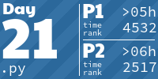

<h1>Repo for all AoC solutions</h1>

<!-- AOC TILES BEGIN -->
<h1 align="center">
  Advent of Code - 240/550 ⭐
</h1>
<h1 align="center">
  2024 - 50 ⭐ - 
</h1>

<h1 align="center">
  2019 - 28 ⭐ - Python
</h1>

<h1 align="center">
  2018 - 12 ⭐ - Python
</h1>

<h1 align="center">
  2017 - 50 ⭐ - Python
</h1>

<h1 align="center">
  2016 - 50 ⭐ - Python
</h1>

<h1 align="center">
  2015 - 50 ⭐ - Python
</h1>

<!-- AOC TILES END -->
